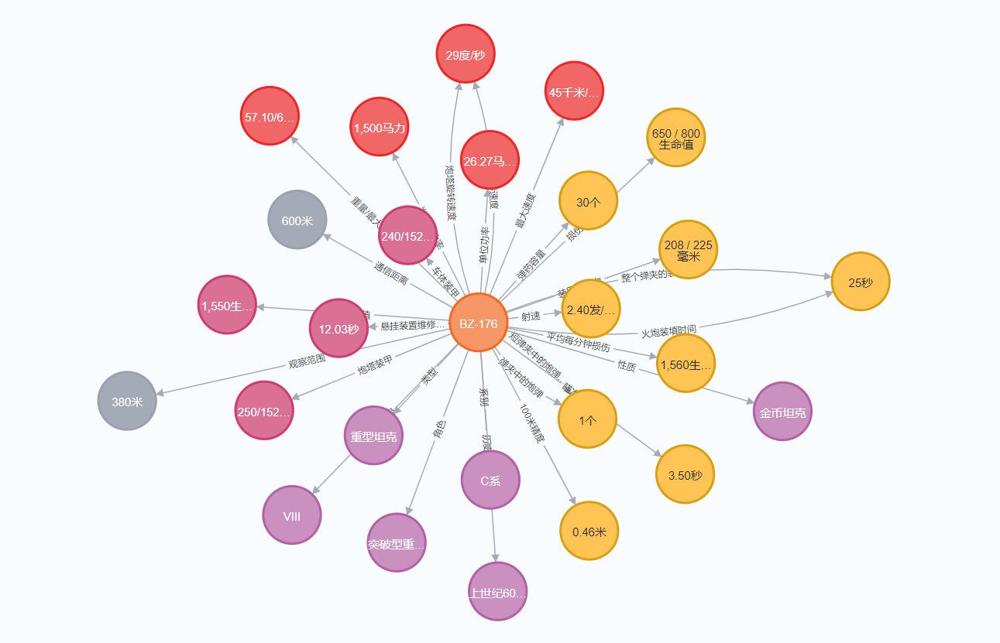
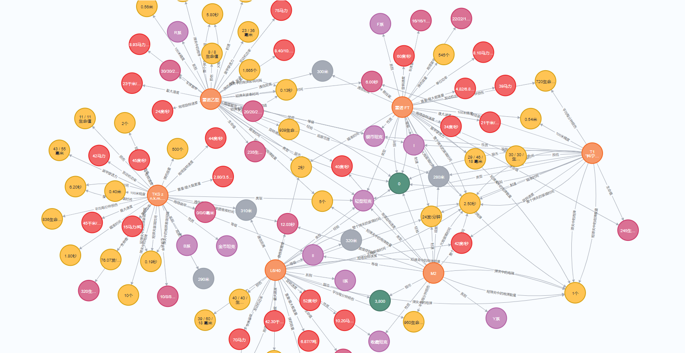

<h1 align="center" style="font-family:Consolas, Monaco, 'Andale Mono', monospace">WOT</h1>

    
    
    
    

World of Tanks(WOT) Knowledge Graph

## 知识图谱可视化
- 单辆坦克

- 知识图谱局部

## 环境说明
    本项目要求的python版本为≥3.9，构建知识图谱所使用的图数据库为neo4j=5.12.0，jdk=17.0.8

## Usage
- 爬虫篇：[详情请参阅README](spider/README.md)

- 知识图谱篇：[详情请参阅README](libs/README.md)

## 知识图谱说明
对于任意一辆坦克，都有以下属性：

    Tank：
        系别：
        类型：
        等级：
        角色：
        性质：
        历史背景：
        价格：
            银币：
            经验：
        火力：
            损伤：
            装甲穿透力：
            火炮装填时间：
            最小弹震持续时间：
            最大弹震持续时间：
            射速：
            平均每分钟损伤：
            瞄准时间：
            100米精度：
            弹药容量：
        机动性：
            重量/最大载重量：
            发动机功率：
            单位功率：
            最大速度：
            旋转速度：
            炮塔旋转速度：
        防护：
            生命值：
            车体装甲：
            炮塔装甲：
            悬挂装置维修时间：
        侦察：
            观察范围：
            通信距离：
